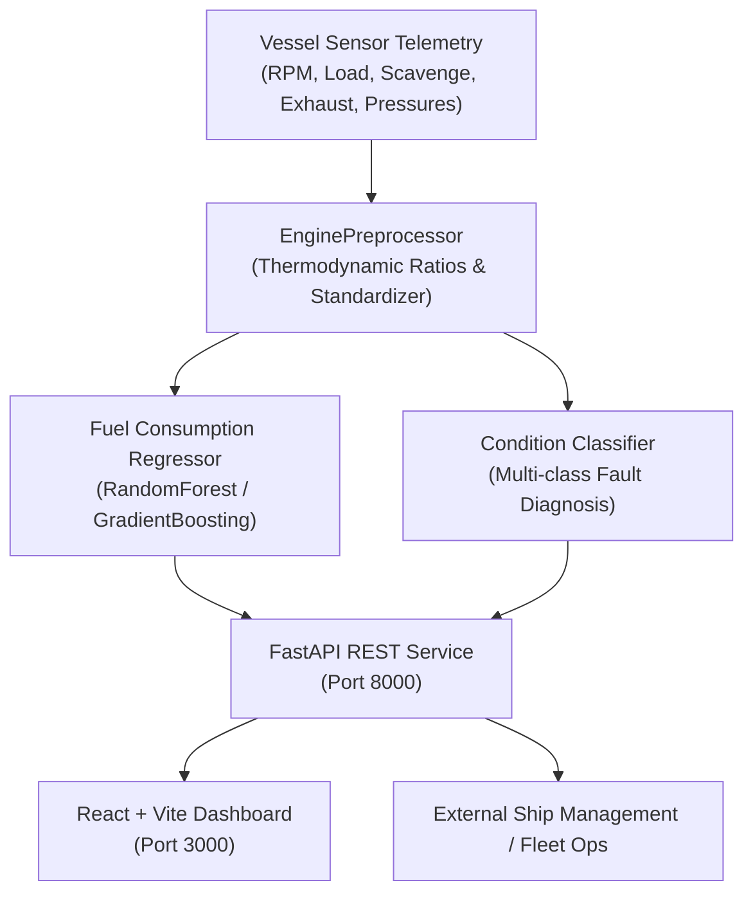

# Marine Engine ML API & Predictive Telemetry Dashboard

[](https://fastapi.tiangolo.com)
[](https://react.dev)
[](https://www.typescriptlang.org)
[](https://scikit-learn.org)
[](https://www.docker.com)
[](LICENSE)

An end-to-end Machine Learning and predictive telemetry system for **commercial marine propulsion diesel engines** (modeled after MAN B&W 6S50ME / 7S60ME two-stroke low-speed engines). 

The platform features:
1. **Fuel Oil Consumption & SFOC Regression**: Physics-informed machine learning estimation of hourly fuel mass flow (`kg/h`) and Specific Fuel Oil Consumption (`g/kWh`) based on propeller law curves.
2. **Condition-Based Monitoring & Fault Diagnosis**: Multi-class diagnostic classification detecting common marine engineering anomalies:
   - **Normal Operating Condition**
   - **Turbocharger Fouling** (nozzle ring / turbine blade carbon accumulation)
   - **Scavenge Trunk Overheat / Fire Risk** (combustion blow-by)
   - **Fuel Injector Clogged** (thermal cylinder imbalance)
   - **Jacket Cooling System Degradation** (heat exchanger fouling)
3. **Marine Engineer Advisory Engine**: Rule-assisted AI recommendations providing immediate actionable steps for vessel chief engineers and technical superintendents.
4. **Interactive Glassmorphic Telemetry Dashboard**: Built with React 18, Vite, and TypeScript with real-time continuous sensor simulation and cylinder thermal balance visualization.

---

## Architecture Overview



---

## Machine Learning Pipeline

### Monitored Sensor Telemetry (15 Channels)

| Parameter | Unit | Normal Envelope | Description |
|-----------|------|-----------------|-------------|
| `engine_rpm` | RPM | 45.0 - 110.0 | Engine crankshaft speed |
| `engine_load_pct` | % | 25.0 - 100.0 | Operational percentage of MCR |
| `scavenge_air_pressure_bar` | bar | 0.5 - 3.8 | Scavenge manifold charge air pressure |
| `scavenge_air_temp_c` | °C | 32.0 - 55.0 | Charge air temperature after cooler |
| `turbocharger_rpm` | RPM | 6,000 - 22,000 | Turbocharger rotor speed |
| `exhaust_gas_temp_avg_c` | °C | 280.0 - 450.0 | Mean cylinder exhaust temperature |
| `exhaust_gas_temp_deviation_c` | °C | 5.0 - 25.0 | Max spread between hottest & coolest cylinder |
| `fuel_oil_inlet_pressure_bar` | bar | 6.5 - 9.0 | Fuel rail supply pressure |
| `fuel_oil_inlet_temp_c` | °C | 125.0 - 145.0 | Pre-heated HFO injection temperature |
| `lub_oil_pressure_bar` | bar | 3.5 - 5.0 | Crosshead & main bearing lube pressure |
| `lub_oil_temp_c` | °C | 42.0 - 55.0 | Lube oil inlet temperature |
| `cooling_water_temp_out_c` | °C | 78.0 - 90.0 | Jacket cooling water outlet temperature |
| `cooling_water_pressure_bar` | bar | 2.5 - 4.5 | Jacket fresh water pump pressure |
| `ambient_temp_c` | °C | 15.0 - 45.0 | Engine room ambient temperature |
| `vessel_speed_knots` | knots | 10.0 - 22.0 | Ship speed over ground |

### Engineered Thermodynamic Indicators
- **$\text{TC Pressure Ratio}$**: $\frac{P_{\text{scavenge}}}{\text{TC RPM} / 10000}$ (detects nozzle ring choking and compressor fouling).
- **$\text{Thermal Load Ratio}$**: $\frac{T_{\text{exhaust}}}{\text{Load \%}}$ (detects afterburning and late combustion).
- **$\text{Cooling Delta}$**: $T_{\text{cooling, out}} - T_{\text{ambient}}$ (jacket water heat rejection efficiency).
- **$\text{Power Demand Proxy}$**: $\frac{\text{Load \%} \times \text{RPM}}{100}$.
- **$\text{Viscosity Control Deviation}$**: $|T_{\text{fuel}} - 135^\circ\text{C}|$.

---

## API Endpoints Reference

Base URL: `http://localhost:8000`

### 1. Health & Readiness Check
- **`GET /health`**
- Returns server status, model readiness, and vessel engine profile.

### 2. Real-Time Telemetry Inference
- **`POST /api/v1/predict`**
- **Request Body**:
  ```json
  {
    "engine_rpm": 98.5,
    "engine_load_pct": 78.0,
    "scavenge_air_pressure_bar": 2.65,
    "scavenge_air_temp_c": 44.2,
    "turbocharger_rpm": 16200.0,
    "exhaust_gas_temp_avg_c": 382.0,
    "exhaust_gas_temp_deviation_c": 12.4,
    "fuel_oil_inlet_pressure_bar": 7.5,
    "fuel_oil_inlet_temp_c": 134.8,
    "lub_oil_pressure_bar": 3.9,
    "lub_oil_temp_c": 49.5,
    "cooling_water_temp_out_c": 85.2,
    "cooling_water_pressure_bar": 3.4,
    "ambient_temp_c": 27.0,
    "vessel_speed_knots": 18.5
  }
  ```
- **Response**:
  ```json
  {
    "predicted_fuel_consumption_kg_h": 1982.5,
    "predicted_sfoc_g_kwh": 169.4,
    "engine_condition": "Normal",
    "condition_confidence": 0.985,
    "health_index": 96.2,
    "severity": "normal",
    "class_probabilities": {
      "Normal": 0.985,
      "Turbocharger Fouling": 0.008,
      "Scavenge Fire Warning": 0.001,
      "Fuel Injector Clogged": 0.004,
      "Cooling System Issue": 0.002
    },
    "recommendations": [
      "Engine operation within optimal continuous service rating (CSR)."
    ],
    "warnings": []
  }
  ```

### 3. Batch Telemetry Prediction
- **`POST /api/v1/predict/batch`**
- Accepts an array of sensor telemetry records for fleet-wide batch processing.

### 4. Telemetry Simulation Stream
- **`GET /api/v1/telemetry/simulate?scenario=normal`**
- Generates fluctuating sensor values for live monitoring demonstrations. Supported scenarios: `normal`, `tc_fouling`, `scavenge_fire`, `injector_clog`, `cooling_issue`.

### 5. Model Architecture & Metrics
- **`GET /api/v1/model/info`**
- Returns model version, engineered features, and training evaluation metrics ($R^2$, MAE, accuracy).

---

## Quickstart with Docker Compose

Run both the FastAPI backend and React frontend dashboard with a single command:

```bash
docker compose up --build
```

- **Frontend Dashboard**: Open [http://localhost:3000](http://localhost:3000)
- **FastAPI Interactive Docs**: Open [http://localhost:8000/docs](http://localhost:8000/docs)
- **Health Check**: [http://localhost:8000/health](http://localhost:8000/health)

---

## Local Development Setup

### 1. Backend Setup
```bash
# Create and activate Python virtual environment
python3 -m venv .venv
source .venv/bin/activate

# Install dependencies
pip install -r backend/requirements.txt

# Run model training and pipeline serialization
python -m backend.src.train

# Run automated tests
pytest -v

# Start FastAPI development server
uvicorn backend.api.main:app --reload --host 0.0.0.0 --port 8000
```

### 2. Frontend Setup
```bash
cd frontend

# Install Node dependencies
npm install

# Start Vite development server
npm run dev

# Or build production assets
npm run build
```

---

## Exploratory Data Analysis & Notebooks

Interactive Jupyter notebooks are provided under `backend/notebooks/`:
- `01_eda.ipynb`: Exploratory data analysis, propeller law curves, and SFOC bathtub profiles.
- `02_preprocessing.ipynb`: Domain thermodynamic feature engineering and sensor bounds validation.
- `03_model_training.ipynb`: Dual-model training (Random Forest Regressor & Classifier).
- `04_model_comparison.ipynb`: Benchmark comparing Ridge, Random Forest, Decision Tree, and Gradient Boosting.

---

## License
MIT License. Built for maritime decarbonization, IMO CII rating monitoring, and predictive propulsion maintenance.
